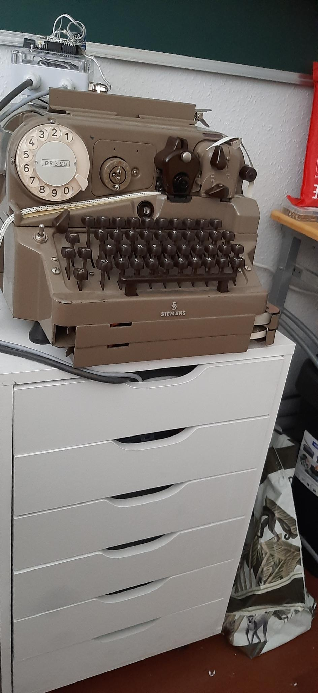
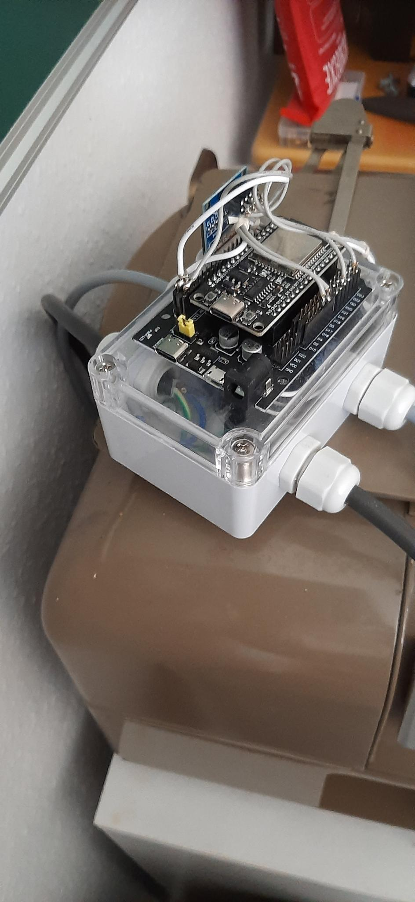

**Programme:** `RTTY_Wetter_20.py` (ESP32 / MicroPython), `fernschreiber_emulator.py` (PC),
`test_rtty.py` (Prüfprogramm), `erstelle_fernschreiber_seite.py` (die Seite mit der Simulation).

> **Kurzfassung.** Ein ESP32 holt zyklisch echte Wetterdaten aus dem Netz (wttr.in) und druckt sie
> auf einem **Siemens T68d** aus — einem **Streifenschreiber**, der fortlaufend auf einen schmalen
> Papierstreifen schreibt. Übertragen wird im klassischen **RTTY-Verfahren** im **ITA2/Baudot-Code**
> bei **50 Baud**: fünf Bit je Zeichen, ein Startbit, anderthalb Stoppbits. Ein OLED zeigt den
> Zustand. Ein Emulator bildet Maschine und Anzeige auf dem PC nach und benutzt dazu die *echten*
> Funktionen der ESP32-Software; eine HTML-Seite tut dasselbe im Browser.

---

# 1. Systemüberblick und Datenfluss

{width=58%}

Die Kette hat fünf Stufen:

```
 Internet (wttr.in) ──HTTP──►  ESP32  ──RTTY/ITA2, 50 Baud──►  Siemens T68d (Streifenschreiber)
                                 │
                                 ├──I2C──► OLED 128 × 64 (Zustand)
                                 └──GPIO──► Motor-/Freigaberelais
```

1. **Abruf.** Der ESP32 fragt über WLAN die Wetterwerte für Künzelsau ab — in *einem* Aufruf,
   neun Felder, durch „|“ getrennt.
2. **Uhr.** Aus dem HTTP-Kopf derselben Antwort wird Datum und Uhrzeit gelesen und die interne Uhr
   gestellt (neu in Version 20, Kapitel 6). Es wird kein Zeitdienst gebraucht.
3. **Prüfung.** Die Antwort wird auf Gültigkeit und auf Änderungen gegenüber dem letzten Stand geprüft.
4. **Aufbereitung.** Der Text wird transliteriert (Umlaute, Sonderzeichen), auf die Streifenbreite
   umbrochen und in ITA2-Codes übersetzt.
5. **Ausgabe.** Jedes Zeichen geht bitseriell über einen GPIO-Pin als RTTY-Signal an die Maschine;
   der Motor wird vorher freigegeben. Parallel zeigt das OLED den Zustand.

Der **Emulator** ersetzt Stufe 5 (Maschine, OLED, Motor) durch eine Bildschirmdarstellung und behält
die Stufen 1 bis 4 **im Originalcode**.

# 2. Hardware und Anschlüsse

{width=58%}

| Baugruppe | Anschluss | Aufgabe |
|:--|:--|:--|
| ESP32-WROOM | — | Steuerrechner (MicroPython). Bewusst WROOM ohne PSRAM, damit GPIO 16 und 17 frei bleiben. |
| Siemens T68d | GPIO **17** (TX) | empfängt das serielle RTTY-Signal (Start, fünf Datenbits, Stopp). |
| Motor / Freigabe | GPIO **16** | schaltet den Motor der Maschine über Relais oder Treiber. |
| OLED SSD1306 128 × 64 | I2C: SDA **21**, SCL **22** | Zustandsanzeige. |
| ADC-Kanäle | GPIO **32, 33, 34** | optionale Analogeingänge (Platzhalter `KANAL1` bis `KANAL3` im Text). ADC1-Pins — sie arbeiten zusammen mit dem WLAN. |

Die Pinbelegung steht im Kopf von `RTTY_Wetter_20.py` und ist gegen den Quelltext geprüft:
`Freigabe = 16`, `T68dSender(tx_pin=17, adc_pins=[32,33,34])`, `I2C(0, scl=Pin(22), sda=Pin(21))`.

> **Wichtig.** GPIO 16 und 17 sind nur auf **WROOM**-Modulen frei; auf **WROVER** (mit PSRAM) sind
> sie belegt, dort müsste man umbelegen. Der Pegel zum T68d wird über eine passende Schnittstelle
> geführt (Optokoppler, Pegelwandler, Stromschleife); die Software liefert am GPIO nur einen
> logischen Pegel 0 oder 1.

# 3. Theorie: RTTY, ITA2 und das Sende-Frame

## 3.1 Das Start-Stopp-Verfahren

**RTTY** überträgt Zeichen seriell als Folge von **Mark** (logisch 1, zugleich der Ruhepegel) und
**Space** (logisch 0). Jedes Zeichen ist ein eigener Rahmen:

```
 Ruhe(1) │ Start(0) │ b1 b2 b3 b4 b5 │ Stopp(1; 1,5 Bit) │ Ruhe(1) …
          └ 1 Bit  ┘└─ 5 Datenbits ─┘└──── 1,5 Bit ────┘
```

Der **Startbit** kündigt das Zeichen an und synchronisiert den Empfänger; es folgen **fünf
Datenbits**; der **Stoppbit** mit **anderthalbfacher** Bitlänge trennt die Zeichen. Weil jedes
Zeichen neu synchronisiert wird, sind kleine Zeitfehler unkritisch — deshalb genügt in der Software
ein einfaches `time.sleep()`.

## 3.2 Baudrate und Zeiten

Bei **50 Baud** dauert ein Bit

$$ t_{\text{Bit}} = \frac{1}{50\ \text{s}^{-1}} = 20{,}0\ \text{ms}. $$

Ein Rahmen belegt $1 + 5 + 1{,}5 = 7{,}5$ Bit, also

$$ t_{\text{Zeichen}} = 7{,}5 \cdot 20\ \text{ms} = 150\ \text{ms} \quad\Longrightarrow\quad 6{,}67\ \text{Zeichen je Sekunde}. $$

Das ist das gemächliche Tickern eines Fernschreibers. Im Quelltext stehen diese Zahlen **als
Klassenattribute** von `T68dSender` — nicht als Modulkonstanten:

```python
class T68dSender:
    BAUD_RATE = 50
    BIT_TIME  = 1 / BAUD_RATE      # 0,020 s
    STOP_TIME = BIT_TIME * 1.5     # 0,030 s
```

`_send_frame` greift folgerichtig mit `self.BIT_TIME` und `self.STOP_TIME` darauf zu. Das ist
wichtig für den Emulator: er erbt von `T68dSender` und kann die Zeiten überschreiben, ohne die
Firmware anzufassen.

## 3.3 Zwei Ebenen: LTRS und FIGS

Fünf Bit ergeben nur $2^5 = 32$ Kombinationen — zu wenig für Buchstaben *und* Ziffern. ITA2 löst das
mit zwei Ebenen, zwischen denen zwei eigene Codes umschalten:

| Steuercode | Bitmuster | Wirkung |
|:--|:--|:--|
| LTRS | `11111` | auf die Buchstabenebene umschalten |
| FIGS | `11011` | auf die Ziffern- und Zeichenebene umschalten |
| CR | `01000` | zum Anfang der Zeile (Wagenrücklauf) |
| LF | `00010` | ein Schritt weiter (Zeilenvorschub) |

Derselbe Fünf-Bit-Code bedeutet je nach Ebene etwas anderes: `10111` ist in der Buchstabenebene ein
**Q**, in der Zifferebene eine **1**. Der Sender merkt sich die Ebene in `self._mode` und schaltet
nur, wenn sie wechselt (`_shift_to`) — jede Umschaltung kostet einen vollen Rahmen, also 150 ms.

**Was das kostet, in Zahlen.** Ein vollständiger Wetterbericht (Kapitel 5.8, Beispielabruf aus dem
Druckbild) besteht aus **308 Rahmen**: 226 Zeichen, **42 Umschaltungen** und 26 Wagenrückläufe und
Zeilenvorschübe, dazu die zwölf Rahmen des Kopfes. Die 42 Umschaltungen sind 6,3 s der insgesamt
**46,2 s** Sendezeit, also 13,6 %. Ein Grund dafür ist eine Feinheit des Quelltextes: das
Leerzeichen steht in *beiden* Tabellen, und `_send_char` fragt die Buchstabentabelle zuerst ab —
darum schaltet jedes Leerzeichen mitten in einer Zahlenkolonne auf die Buchstabenebene zurück und
das nächste Zeichen wieder zurück in die Zifferebene.

## 3.4 Die Bitreihenfolge

Die Codes stehen im Quelltext als Zeichenkette in der Reihenfolge Bit 5 … Bit 1, zum Beispiel
`'A' : '00011'`. Gesendet wird das **niederwertige Bit zuerst** (ITA2-Konvention). `_send_frame`
durchläuft die Kette deshalb von Index 4 nach Index 0:

```python
def _send_frame(self, bits):
    self._tx.value(0); time.sleep(self.BIT_TIME)          # Startbit
    for i in range(4, -1, -1):                            # 5 Datenbits, niederwertiges zuerst
        self._tx.value(int(bits[i])); time.sleep(self.BIT_TIME)
    self._tx.value(1); time.sleep(self.STOP_TIME)         # Stoppbit, 1,5 Bit lang
```

Für **A** (`00011`) geht damit die Folge 1, 1, 0, 0, 0 auf die Leitung — der Standard-ITA2-Code
für A. Von Hand nachzurechnen: Zeichenkette rückwärts lesen.

# 4. Was der Streifenschreiber druckt

{width=58%}

Der T68d ist ein **Streifenschreiber**: er druckt fortlaufend auf einen schmalen Papierstreifen, der
seitlich aus der Maschine läuft. Es gibt kein Blatt, keine Seite und keinen Wagen. Daraus folgen
drei Dinge, die man dem Ausdruck ansieht:

1. **Wagenrücklauf und Zeilenvorschub werden gedruckt.** Weil kein Wagen zurückzufahren ist,
   erscheinen CR und LF als sichtbare Zeichen: „&lt;“ für den Wagenrücklauf, „≡“ für den
   Zeilenvorschub. Das Foto belegt es unmittelbar: der Streifen beginnt mit `<<<<≡≡≡≡WETTER
   KUENZELSAU AM 10.07.2026 UM 16:55:09` — genau die vier CR und vier LF aus `print_header()`.
   Die vier LTRS, die dort ebenfalls gesendet werden, drucken nichts und rücken den Streifen auch
   nicht vor; im Bild folgt auf das achte Steuerzeichen sofort das W.
2. **Die „Zeilenlänge“ ist eine Streifenbreite.** `T68D_LINE_LENGTH = 69` bedeutet: der weiche
   Umbruch in `_wrap_lines` setzt nach spätestens 69 Zeichen ein `\n`, damit die Abschnitte auf dem
   Streifen eine handhabbare Länge bekommen. Im Beispielausdruck ist die längste Zeile 44 Zeichen
   lang, der Umbruch greift dort also gar nicht — er ist die Schranke für lange Wetterlagetexte.
3. **Der Streifen trägt neben der Schrift eine Lochung.** Das Video zeigt sie: unter der Zeile
   stehen die Codelöcher. Die Zuordnung der Spuren am Gerät ist nicht nachgemessen; die Simulation
   zeichnet sie nach der Fünf-Spur-Norm (Transportloch zwischen Spur 2 und 3) und sagt das dort
   auch.

# 5. Die ESP32-Software `RTTY_Wetter_20.py`

## 5.1 Einstellungen und Konstanten

| Name | Wert | Bedeutung |
|:--|:--|:--|
| Netzname und Kennwort | Platzhalter | die beiden Zeilen am Kopf der Datei; in der Veröffentlichung heißen sie `WLAN_NAME` und `WLAN_WORT` und tragen Platzhalter (siehe Kapitel 11). |
| `Freigabe` | 16 | GPIO für Motor und Freigabe. |
| `T68D_LINE_LENGTH` | 69 | größte Zeichenzahl je Abschnitt auf dem Streifen. |
| `KOMPLETT_INTERVALL` | 6 · 3600 s | nach spätestens sechs Stunden wird ein Komplettdruck erzwungen. |
| `ABFRAGE_INTERVALL` | 2 · 60 s | alle zwei Minuten wird bei wttr.in nachgesehen. |
| `IMMER_DRUCKEN` | `False` | `False` = nur bei Änderung drucken; `True` = bei jeder gültigen Abfrage komplett drucken. |

## 5.2 WLAN

**`connect_wifi()`** — aktiviert die Station-Schnittstelle, verbindet mit den beiden Zugangsdaten und
wartet bis zu 10 s (50 × 0,2 s). Bei Erfolg wird die Adresskonfiguration ausgegeben und das
WLAN-Objekt zurückgegeben, sonst wird ein `RuntimeError` geworfen.

## 5.3 Die Zustandsanzeige

**`oled_status(oled, wlan_ok, drucktext)`** zeichnet vier Zeilen:

| Zeile | y | Inhalt |
|:--|--:|:--|
| 1 | 0 | `WLAN OK` oder `KEIN WLAN` |
| 2 | 16 | Datum `TT.MM.JJJJ` aus `time.localtime()` |
| 3 | 26 | Uhrzeit `HH:MM:SS` |
| 4 | 40 | Laufschrift des Drucktextes, sonst `BEREIT` |

Der Rollzustand liegt in der modulglobalen `scroll_pos`, damit die Laufschrift bei
aufeinanderfolgenden Aufrufen weiterwandert; ohne Drucktext wird sie auf 0 zurückgesetzt. Das
Zeichenraster des SSD1306 ist 8 × 8 Punkte, das Fenster der Laufschrift also 16 Zeichen breit.

## 5.4 Codetabellen und Transliteration

* **`_BAUDOT_LETTERS`** — 27 Einträge: A bis Z und das Leerzeichen, jeweils auf einen Fünf-Bit-Code.
* **`_BAUDOT_FIGURES`** — 26 Einträge: Ziffern, Satzzeichen, Klingel (`\a`) und wieder das Leerzeichen.
* **`TRANSLITERATION`** — alles, was ITA2 nicht kennt: Umlaute (`Ä` → `AE`, `ß` → `ss`), Akzente
  (`É` → `E`), Sonderzeichen (`°` → ` GRAD `, `%` → ` PROZ `, `@` → `(AT)`), Klammern, Tabulator und
  der Zeilenumbruch (`\n` → `\r\n`).

**`sanitize_weather_text(text)`** wandelt die Unicode-Symbole der Wetterdaten in Kürzel: die acht
Windpfeile in Himmelsrichtungen (`↙` → `SW`) und die acht Mondzeichen in Wörter (das Vollmondzeichen U+1F315 wird zu `VOLLMOND`).
Beides sind reine Zeichenkettenersetzungen und laufen **vor** der Transliteration.

## 5.5 Die Klasse `T68dSender`

Sie kapselt die gesamte ITA2-Ausgabe. Zustand: `self._tx` (der TX-Pin), `self._mode` (die aktuelle
Ebene) und `self._adcs` (die drei Analogeingänge).

**`__init__(tx_pin=17, adc_pins=[32,33,34])`** setzt den TX-Pin auf den Ruhepegel 1 und richtet die
drei ADC ein (11 dB Dämpfung, 12 Bit).

**Öffentliche Methoden**

* **`sync(duration=0.5)`** — hält die Leitung für die angegebene Zeit auf Mark, damit die Maschine
  den Ruhepegel findet, bevor gedruckt wird. `main()` ruft sie mit 1,0 s auf.
* **`send_text(text)`** — die zentrale Routine, fünf Schritte in dieser Reihenfolge:
  1. `_expand_shortcodes` — ersetzt `DATUM` und `ZEIT` durch die aktuellen Werte,
  2. `_expand_adc` — ersetzt `KANAL1` bis `KANAL3` durch die gemessene Spannung,
  3. `_expand` — Transliteration,
  4. `_wrap_lines` — weicher Umbruch auf 69 Zeichen,
  5. Senden: jedes Zeichen über `_send_char`, jedes `\n` über `send_crlf`.
* **`send_line(text)`** — `send_text(text)` und danach `send_crlf()`.
* **`send_crlf()`** — sendet CR und LF.
* **`reset_shift()`** — sendet zweimal LTRS und setzt `_mode = 'LTRS'`.

**Innere Hilfen**

* **`_expand_shortcodes(text)`** — `DATUM` → `TT.MM.JJJJ`, `ZEIT` → `HH:MM:SS` aus `time.localtime()`.
* **`_expand_adc(text)`** — liest bei Bedarf den Kanal und rechnet $U = \text{raw}\cdot 3{,}3\,\text{V}/4095$,
  eingesetzt mit zwei Nachkommastellen.
* **`_wrap_lines(text)`** — teilt jeden Absatz an Leerzeichen in Wörter und füllt Abschnitte bis
  höchstens 69 Zeichen; das Trennzeichen wird mitgezählt (`sep = 1 if current else 0`). Der
  Off-by-one früherer Fassungen ist damit behoben.
* **`_expand(text)`** — geht Zeichen für Zeichen: was in einer der beiden Tabellen steht, bleibt;
  sonst wird transliteriert (erst das Zeichen selbst, dann seine Großform); bleibt beides erfolglos,
  wird `[?]` eingesetzt und eine Warnung ausgegeben.
* **`_send_char(ch)`** — schaltet über `_shift_to` die Ebene und sendet den Code. Die
  Buchstabentabelle wird zuerst geprüft (siehe die Bemerkung zum Leerzeichen in Kapitel 3.3).
* **`_shift_to(mode)`** — sendet LTRS oder FIGS **nur** bei einem Wechsel.
* **`_send_frame(bits)`** — erzeugt den Rahmen auf dem Pin (Quelltext in Kapitel 3.4).

## 5.6 Wetterabruf

`WEATHER_FIELDS` und `WEATHER_FORMAT` gehören zusammen und **müssen dieselbe Reihenfolge haben**:

```
Felder:  TEMP GEFUEHLT FEUCHTE DRUCK WIND WETTER AUFGANG UNTERGANG MOND
Format:  %t | %f | %h | %P | %w | %C | %S | %s | %m
```

**`get_weather_all()`** baut die Adresse `http://wttr.in/Kuenzelsau?format=<WEATHER_FORMAT>` (der Ort
in ASCII, ohne Umlaut), holt **eine** Antwort, schließt den Socket in jedem Fall (`try/finally`),
trennt an „|“ und ordnet zu. Stimmt die Teilezahl nicht, liefert die Funktion für alle Felder
`"ERR format"`; bei einem Netzfehler `"ERR <Meldung>"`.

> **Kein `%d`.** Bei wttr.in ist `%d` die *Abenddämmerung* (Dusk), eine Uhrzeit — **nicht** die
> Windrichtung. Die Richtung steckt bereits als Pfeil in `%w`. Siehe Kapitel 13.

## 5.7 Gültigkeit und Änderung

* **`is_value_valid(v)`** — ungültig ist ein leerer Wert, ein Wert, der mit `ERR` beginnt, oder einer,
  der `not available`, `unknown location`, `sorry` oder `we were unable` enthält.
* **`is_valid(data)`** — der Datensatz gilt, wenn **mindestens ein** Feld gültig ist.
* **`has_changed(new, prev)`** — vergleicht nur die gültigen Felder und liefert
  `(True/False, Liste der geänderten Felder)`.

## 5.8 Die Druckfunktionen

* **`FIELD_LABELS`** — Feldname zu Beschriftung, zum Beispiel `AUFGANG` → `SONNENAUFGANG`. Ein Feld
  `RICHTUNG` gibt es nicht mehr.
* **`print_header(sender)`** — viermal CR, viermal LF, viermal LTRS, dann `_mode = 'LTRS'`. Das sind
  die zwölf Rahmen, die man am Anfang des Streifens sieht.
* **`print_footer(sender)`** — Leerzeile, `RYRYRYRYRY` (das klassische Prüfmuster: R und Y liegen im
  Code weit auseinander und belasten die Mechanik gleichmäßig) und `55 73 AR SK`
  (Fernschreib- und Amateurfunk-Grußformeln).
* **`send_komplett(sender, w)`** — Motor an, 2 s Anlauf, Kopf, Überschrift
  `WETTER KUENZELSAU AM DATUM UM ZEIT` (die beiden Wörter werden von `_expand_shortcodes` ersetzt),
  die neun Felder, Fuß, 5 s Nachlauf, Motor aus.
* **`send_aenderung(sender, w, changed_keys)`** — dasselbe, aber nur mit den geänderten Feldern und
  mit `ZEIT` als Kopfzeile.

**Der Beispielausdruck, nachgerechnet.** Für den gespeicherten Abruf des Druckbildes
(`+28°C|+28°C|30%|1016hPa|↙12km/h|Sunny|05:26:34|21:26:10|` und dahinter das Zeichen für den
abnehmenden Mond, U+1F318; 10.07.2026 um 16:55:09) ergibt der
Komplettdruck:

| Größe | Wert |
|:--|--:|
| Rahmen des Kopfes (4 CR, 4 LF, 4 LTRS) | 12 |
| Zeichenrahmen | 226 |
| Umschaltungen LTRS/FIGS | 42 |
| Wagenrückläufe und Zeilenvorschübe | 28 |
| **Rahmen insgesamt** | **308** |
| Sendezeit bei 150 ms je Rahmen | **46,2 s** |
| dazu Motorvorlauf und -nachlauf | 2 s + 5 s |
| längster Abschnitt | 44 von 69 Zeichen |

Diese Zahlen sind mit `nachrechnung_ita2.py` aus der Firmware gerechnet, nicht geschätzt.

## 5.9 Das Hauptprogramm `main()`

1. OLED einrichten, Startbild.
2. `connect_wifi()`.
3. `sync_time_from_weather()` — die Uhr aus dem HTTP-Kopf stellen (Kapitel 6).
4. Adresse anzeigen, `T68dSender` erzeugen, `sync(1.0)`.
5. **Endlosschleife im Sekundentakt:**
   * `oled_status(...)` — die Uhr läuft jede Sekunde weiter;
   * ist seit dem letzten Abruf weniger als `ABFRAGE_INTERVALL` vergangen, wird 1 s geschlafen und
     kein Netzzugriff gemacht;
   * sonst: liegt die letzte Uhrsynchronisation über 3600 s zurück, wird die Uhr nachgezogen; dann
     Wetter holen, Debug ausgeben, Gültigkeit prüfen;
   * **erster gültiger Datensatz** → Komplettdruck;
   * sonst **6-Stunden-Intervall erreicht** → Komplettdruck, andernfalls **Änderung** →
     Änderungsdruck, andernfalls bei `IMMER_DRUCKEN = True` → Komplettdruck, sonst kein Druck;
   * die gültigen Werte werden in `previous_data` übernommen.

Die Trennung von Abfragetakt (zwei Minuten) und Anzeigetakt (eine Sekunde) hält die Uhr flüssig,
ohne wttr.in zu belasten.

# 6. Neu in Version 20: die Uhr aus den Wetterdaten

Version 19 hatte keine gestellte Uhr: `time.localtime()` lieferte die Zeit seit dem Einschalten,
und im Ausdruck stand ein falsches Datum. Version 20 holt beides aus dem **HTTP-Kopf** derselben
Antwort, die ohnehin geholt wird — ohne Zeitdienst, ohne zusätzliche Bibliothek, mit reiner
Arithmetik, die man von Hand nachrechnen kann.

| Funktion | Aufgabe |
|:--|:--|
| `_http_date_header(host, path)` | öffnet ein rohes Socket, schickt eine `GET`-Anfrage mit `HTTP/1.0` und liest nur den Kopf (höchstens 1500 Byte, in 128er-Stücken, bis `\r\n\r\n` kommt); gibt die Zeile `Date:` zurück. Auf dem PC gibt es kein `usocket`; dort bleibt `socket = None` und die Funktion liefert `None`. |
| `_parse_http_date(s)` | zerlegt `"Wed, 09 Jul 2026 15:26:11 GMT"` in ein Tupel in UTC. |
| `_tage_im_monat(y, m)` | Monatslängen mit der vollständigen Schaltjahrregel (durch 4, aber nicht durch 100, außer durch 400). |
| `_wochentag_so0(y, m, d)` | Zellers Kongruenz, 0 = Sonntag. |
| `_letzter_sonntag(y, m)` | zählt vom Monatsende rückwärts, bis der Wochentag 0 ist. |
| `_ist_sommerzeit(y, mon, d, hh)` | die EU-Regel: MESZ vom letzten Sonntag im März 01:00 UTC bis zum letzten Sonntag im Oktober 01:00 UTC. |
| `_stunden_addieren(...)` | addiert +1 h (MEZ) oder +2 h (MESZ) und rollt Tag, Monat und Jahr sauber über. |
| `sync_time_from_weather()` | setzt alles zusammen und stellt über `machine.RTC().datetime(...)` die Uhr. Gibt `True` zurück, wenn es geklappt hat. |

`main()` ruft die Funktion einmal beim Start und danach etwa stündlich
(`(jetzt - letzter_zeitsync) >= 3600`) auf. Schlägt sie fehl, läuft die interne Uhr weiter — es wird
nichts abgebrochen.

**Von Hand nachgerechnet.** Der letzte Sonntag im März 2026: der 31. März 2026 ist nach Zellers
Kongruenz ein Dienstag, also ist der 29. der letzte Sonntag. Für den 9. Juli 2026, 15:26:11 UTC
liegt der Tag zwischen dem 29. März und dem 25. Oktober, also gilt MESZ, und die Ortszeit ist
17:26:11. Genau das prüft `test_rtty.py` in Test E nach.

# 7. Was sich von Version 19 auf Version 20 geändert hat

| # | Änderung | Wirkung |
|--:|:--|:--|
| 1 | `usocket` wird beim Import versucht; fehlt es (PC), bleibt `socket = None`. | Firmware und Emulator laufen mit demselben Quelltext. |
| 2 | Neue Funktionen `_tage_im_monat`, `_wochentag_so0`, `_letzter_sonntag`, `_ist_sommerzeit`, `_stunden_addieren`, `_parse_http_date`, `_http_date_header`, `sync_time_from_weather` sowie die Tabelle `_MONATE`. | Datum und Uhrzeit ohne Zeitdienst; die Umschaltung zwischen MEZ und MESZ geschieht selbsttätig. |
| 3 | `main()` stellt die Uhr nach dem Verbinden und zieht sie stündlich nach (`letzter_zeitsync`). | Datum und Uhrzeit im Ausdruck und auf dem OLED stimmen. |
| 4 | Der Kopfkommentar führt die Änderungen von Version 18 als übernommen weiter. | Die Fassungsgeschichte steht in der Datei selbst. |

**Unverändert geblieben** sind: die beiden ITA2-Tabellen (27 und 26 Einträge), die
Transliterationstabelle, alle vier Steuercodes, die Klasse `T68dSender` mit allen Methoden und
Zeiten, `sanitize_weather_text`, `get_weather_all`, die Gültigkeits- und Änderungslogik,
`FIELD_LABELS`, `print_header`, `print_footer`, `send_komplett`, `send_aenderung`, die Pinbelegung
und alle Intervalle. Der Rechenweg des Druckens ist also derselbe wie in Version 19; wer die
Zeitzeilen abdeckt, liest Version 19.

**Was das Manuskript deshalb richtigstellen musste** (es beschrieb Version 19):

* Die Zeiten `BAUD_RATE`, `BIT_TIME` und `STOP_TIME` sind **Klassenattribute** von `T68dSender`,
  keine Modulkonstanten — schon in Version 18. Der frühere Textauszug war falsch eingerückt.
* Der Zeilenumbruch bricht auf die **Streifenbreite** um; der T68d ist ein Streifenschreiber, kein
  Blattschreiber (Kapitel 4).
* Emulator und Prüfprogramm laden längst `RTTY_Wetter_20`; nur ihre Kopftexte nannten noch
  `RTTY_Wetter_18`.

# 8. Der Emulator `fernschreiber_emulator.py`

Der Emulator führt die **echte** ESP32-Logik auf dem PC aus. Vor dem Import werden die
MicroPython-Module durch Attrappen ersetzt, danach wird `RTTY_Wetter_20` importiert — Kodierung,
Abruf und Drucklogik sind also 1:1 der Originalcode.

**Ereigniskanal.** `EVENTS` (eine thread-sichere `queue.Queue`) trägt drei Ereignisarten von der
„Hardware“ zur Anzeige: `("char", s)` für ein gedrucktes Zeichen, `("oled", [zeilen])` für den
Anzeigeinhalt und `("motor", 0/1)`. `STOP` (ein `threading.Event`) beendet die Hintergrundschleife.

**Attrappen.** `machine` mit `Pin`, `ADC` und `I2C` — `Pin.value()` meldet Schreibzugriffe auf Pin 16
als Motorereignis, `ADC.read()` liefert 2048 (≈ 1,65 V). `network.WLAN` tut so, als sei verbunden.
`urequests` greift über `urllib` wirklich zu, damit echte Wetterdaten kommen; das rohe „|“ in der
Adresse wird für CPython zu `%7C` kodiert (auf dem ESP32 nicht nötig).
`ssd1306.SSD1306_I2C` wird zu `EmuDisplay`, das die `text()`-Aufrufe sammelt und bei `show()` ein
Raster aus 16 × 8 Zeichen meldet.

**`EmuSender(rtty.T68dSender)`** erbt die echte Kodierpipeline und überschreibt nur die untersten
Ausgabepunkte: `_send_char` wartet die Zeichenzeit und meldet das Zeichen, `send_crlf` meldet einen
Umbruch, `_send_frame` (von `print_header` benutzt) meldet bei LF einen Umbruch, `sync` kürzt die
Pause. Der Faktor `SPEED` regelt das Tempo; 1,0 ist echtes 50 Baud.

**Ablauf.** `run_station(once=False)` spiegelt `main()` mit den Demo-Intervallen `DEMO_INTERVAL`
(20 s) und `DEMO_KOMPLETT` (6 h); `force_print()` löst in einem eigenen Thread sofort einen
Komplettdruck aus.

**Oberfläche `gui()`** (tkinter): Anzeigefeld für das OLED (grün auf schwarz), Motorlampe,
Papierstreifen als Textfeld in Schreibmaschinenschrift, Knöpfe *Start*, *Jetzt drucken*, *1× / 4× /
10×* und *Beenden*. `pump()` wird alle 15 ms über `root.after` aufgerufen, leert die Warteschlange
und zeichnet — nur der Oberflächen-Thread zeichnet, deshalb ist das thread-sicher.

**`selftest()`** läuft ohne Grafik: ein Thread schreibt die Zeichen auf die Standardausgabe,
`run_station(once=True)` erzeugt einen Komplettdruck, danach ist Schluss. Fällt die Grafik aus,
startet das Programm diesen Weg von selbst.

# 9. Das Prüfprogramm `test_rtty.py`

Es prüft die Logik auf normalem CPython, mit denselben Attrappen wie der Emulator, und lädt ebenfalls
`RTTY_Wetter_20`.

| Test | Was geprüft wird | Schranke |
|:--|:--|:--|
| A | Zerlegen einer gespeicherten wttr.in-Antwort; Fehlformat und „Unknown location“ | neun Felder richtig, Fehlerfälle als ungültig erkannt |
| B | echter Abruf (nur falls Netz da ist) | Datensatz gültig |
| C | RTTY-Rückschleife: Text → **echtes** `_send_frame` → Pegel aufgezeichnet → zurückdekodiert | Zeichen für Zeichen gleich |
| D | Zeilenumbruch | keine Zeile über 69 Zeichen, kein Wort verloren |
| E | Uhr aus dem HTTP-Kopf, Sommerzeit, Stundenaddition | acht Einzelprüfungen |

Die Rückdekodierung in Test C ist ein **unabhängiger zweiter Weg**: sie baut Umkehrtabellen aus den
Originaltabellen, zerlegt die aufgezeichneten Pegel in Rahmen zu sieben Werten (Start, fünf Daten,
Stopp), prüft Start = 0 und Stopp = 1 und dekodiert mit einer eigenen Ebenenverfolgung.

**Ergebnis am 29.09.2026:** 23 Prüfungen bestanden, keine fehlgeschlagen — darunter der Rückschleifentest
für `TEMP +18°C, WIND 12KM/H ÄÖÜ`, der als `TEMP +18 GRAD C, WIND 12KM/H AEOEUE` zurückkommt.

# 10. Die Seite: Simulation im Browser

`erstelle_fernschreiber_seite.py` baut aus dieser Quelle und der Firmware eine einzige HTML-Datei
(`Fernschreiber_1.0.html`), die offline läuft und alles enthält: Werkzeug, Bilder, Video und dieses
Manuskript als Reiter. Die Seite ist kein Nachbau nach Erinnerung — **die beiden ITA2-Tabellen, die
Transliterationstabelle, die vier Steuercodes, die Zeilenlänge, die Baudrate und die Bitzeiten
werden beim Bauen aus `RTTY_Wetter_20.py` eingelesen** und als Daten in die Seite geschrieben. Der
Ablauf (`expand`, `wrapLines`, `rahmen`) ist Zeile für Zeile aus `send_text()` übertragen.

Was die Seite zeigt:

* **Text eingeben und zusehen.** Jede Eingabe wird sofort umgesetzt: erst die Transliteration, dann
  der Umbruch auf 69 Zeichen, dann die Rahmenliste mit Art (Zeichen, LTRS, FIGS, CR, LF), Zeichen,
  dem Code in Tabellenrichtung (Bit 5 … 1) und in Senderichtung (Bit 1 … 5). Darunter die Bilanz:
  wie viele Rahmen, wie viele davon Umschaltungen, und wie lange das dauert.
* **Das Sende-Frame.** Ein Zeitdiagramm des GPIO-Pegels über die letzten vier Rahmen, mit den
  Bitgrenzen und den Codes; darunter der Aufbau eines einzelnen Rahmens mit den Zahlen 20 ms, 20 ms
  je Datenbit und 30 ms Stopp.
* **Der gezeichnete Streifenschreiber.** Er druckt Zeichen für Zeichen im Takt der echten
  Bitzeiten auf einen Streifen, der nach links aus der Maschine läuft — mit Motorlampe, mit „&lt;“
  und „≡“ für CR und LF und mit der Lochung unter der Schrift. Das Tempo ist einstellbar; die
  Vorgabe ist Echtzeit.
* **Der Wetterbericht.** Ein gespeicherter Abruf (kein Netzzugriff) wird genau wie in
  `send_komplett()` aufbereitet und gedruckt, mit Kopf, den neun Feldern und dem Nachspann.
* **Das OLED.** 128 × 64 Punkte mit demselben Aufbau wie `oled_status()`.

Geprüft wird die Seite mit `pruefe_seite.mjs` im echten Browser (Chromium über Playwright); der
Prüfplan `PRUEFPLAN_Seite.md` nennt zu jeder Zeile die Schranke. Die entscheidende Prüfung ist die
Gegenrechnung: `nachrechnung_ita2.py` lässt die **Firmware selbst** auf dem PC laufen und vergleicht
Rahmen für Rahmen mit dem, was der Browser erzeugt — abweichen darf kein einziger.

## 10.6 Der wirkliche Wetterbericht für einen gewählten Ort

Die Seite kann mehr als den gespeicherten Abruf abspielen. Ein Feld nimmt einen Ortsnamen auf, ein
Knopf holt für diesen Ort den **wirklichen, aktuellen** Wetterbericht und druckt ihn auf den Streifen.
Damit steht dieselbe Kette wie am Gerät, nur mit dem Browser als Rechner: abfragen, zerlegen,
transliterieren, umbrechen, nach ITA2 setzen, Rahmen für Rahmen bei 50 Baud drucken.

Eine Eigenheit des Dienstes zwingt dabei zu einem Umweg, der hier festgehalten sei, weil er nicht
offensichtlich ist. Das Gerät fragt `wttr.in` und bekommt auf die Formatzeile hin genau eine Textzeile
mit neun durch `|` getrennten Feldern zurück. Ein Browser bekommt dieselbe Anfrage als **Bildschirmseite**
beantwortet: `wttr.in` entscheidet nach der Browserkennung im Kopf der Anfrage, und diese Kennung darf
eine Seite nicht selbst setzen — der Browser verbietet es. Die Zeile ist aus einer Seite heraus also
nicht zu bekommen.

Die Seite holt deshalb dieselben neun Größen bei einem Dienst, der aus dem Browser heraus antwortet
(Ortssuche und Wetterabruf, beide ohne Schlüssel und beide mit `Access-Control-Allow-Origin: *`), und
setzt sie in **genau das Format**, das das Gerät von `wttr.in` erhält. Ab dieser Zeile läuft alles durch
denselben Code wie in der Firmware; die Umsetzung ist also nach wie vor die des Geräts.

Zwei der neun Felder rechnet die Seite dabei selbst aus:

* **Der Windpfeil.** Der Dienst liefert die Richtung als Winkel. Die Seite rundet ihn auf ein Achtel
  des Vollkreises und setzt den zugehörigen Pfeil, den `sanitize_weather_text()` der Firmware dann wie
  gewohnt in `N`, `NO`, `O`, … übersetzt. Der Pfeil zeigt die Richtung, **aus der** es weht.
* **Die Mondphase.** Sie steht in keinem der Wetterfelder. Die Seite rechnet das Alter des Mondes aus
  der Zeit seit einem bekannten Neumond (6. Januar 2000, 18:14 UTC) modulo dem synodischen Monat von
  29,530 588 853 Tagen und teilt es in acht Abschnitte — dieselben acht Zeichen, die das Gerät kennt.
  Die Rechnung ist eine Näherung: sie unterstellt gleichförmigen Umlauf und geht deshalb um bis zu
  etwa einen halben Tag fehl, was für die Angabe „zunehmend“ oder „abnehmend“ reicht.

Datum und Uhrzeit auf dem Kopf des Ausdrucks sind die **Ortszeit des gewählten Ortes**, wie der Dienst
sie mitliefert. Das Gerät nimmt statt dessen den Zeitstempel aus dem Kopf der Antwort und rechnet ihn
mit der eigenen Sommerzeitregel auf deutsche Zeit um (Abschnitt 6). Für einen Ort in einer anderen
Zeitzone ist die Ortszeit die sinnvollere Angabe; der Unterschied ist damit benannt.

Ohne Netz bleibt es beim gespeicherten Abruf. Die Seite sagt das dann auch und arbeitet unverändert
weiter — sie ist und bleibt eine Datei, die für sich allein läuft.

# 11. Bedienung und Betrieb

## Auf dem ESP32

1. Netzname und Kennwort in die beiden Zeilen am Kopf von `RTTY_Wetter_20.py` eintragen. In der
   veröffentlichten Fassung heißen sie `WLAN_NAME` und `WLAN_WORT` und tragen Platzhalter; das
   Kennwort ist dort durch genauso viele `x` ersetzt, wie es Zeichen hat. (Im Arbeitsexemplar heißen
   die beiden Namen anders; die Ausfuhr benennt sie um, damit kein Prüfmuster für Zugangsdaten
   anschlägt.)
2. Die Datei als `main.py` auf den ESP32 bringen, zusammen mit `ssd1306.py`.
3. Nach dem Start zeigt das OLED den WLAN-Zustand und die Adresse, dann läuft die Station: erster
   gültiger Datensatz → Komplettdruck; danach Druck bei Änderung; alle sechs Stunden ein
   Komplettdruck.

**Stellschrauben:** `ABFRAGE_INTERVALL` (Abfragetakt), `IMMER_DRUCKEN` (immer oder nur bei
Änderung), `KOMPLETT_INTERVALL` (Rhythmus des Komplettdrucks), `T68D_LINE_LENGTH` (Streifenbreite in
Zeichen).

## Auf dem PC

* Emulator mit Grafik: `python3 fernschreiber_emulator.py`, dann *Start*.
* Emulator im Terminal: `python3 fernschreiber_emulator.py --selftest`.
* Prüfprogramm: `python3 test_rtty.py`.
* Seite bauen: `python3 seite/erstelle_fernschreiber_seite.py`.
* ITA2 nachrechnen: `python3 seite/nachrechnung_ita2.py "HALLO WELT 123"`.

Emulator und Prüfprogramm brauchen `RTTY_Wetter_20.py` im selben Ordner; der Emulator braucht
zusätzlich eine Netzverbindung, weil er echte Wetterdaten holt.

# 12. Fehlersuche

| Erscheinung | Mögliche Ursache und Abhilfe |
|:--|:--|
| Kein Druck, OLED zeigt `KEIN WLAN` | Zugangsdaten falsch, WLAN außer Reichweite. |
| Immer „Datensatz ungueltig“ | wttr.in nicht erreichbar oder gedrosselt; Ort und Formatzeile prüfen. |
| Falsche Zeichen, Ebenen vertauscht | Prüfen, ob der Pegel zum T68d invertiert ist; die Tabellen selbst sind durch Test C gedeckt. |
| Zeichen verstümmelt oder doppelt | Geschwindigkeit der Maschine gegen 50 Baud prüfen, Masse und Schnittstelle prüfen. |
| Motor läuft nicht an | GPIO 16, Relais und Treiber prüfen; `motor.value(1)` steht vor jedem Druck. |
| OLED bleibt dunkel | I2C-Verdrahtung (SDA 21, SCL 22), Adresse, `ssd1306.py` vorhanden. |
| Datum oder Uhrzeit falsch | `sync_time_from_weather()` hat keinen `Date:`-Kopf bekommen — die Meldung steht auf der Konsole; die Station läuft weiter mit der internen Uhr. |
| Emulator meldet „Grafik nicht verfuegbar“ | kein Display vorhanden → er startet den Terminaltest von selbst; sonst tkinter nachinstallieren. |

# 13. Entwicklungsgeschichte

| Fassung | Was sie brachte |
|:--|:--|
| 18 | erste laufende Station: ITA2-Ausgabe, Wetterabruf mit zehn Einzelaufrufen, Komplett- und Änderungsdruck. |
| 19 | **ein** kombinierter Abruf statt zehn (keine Drosselung mehr); Socket immer geschlossen; Antwortlänge und Gültigkeit strenger geprüft; Ort in ASCII; Off-by-one im Umbruch behoben; OLED-Uhr im Sekundentakt bei Wetterabruf nur im Intervall; Schalter `IMMER_DRUCKEN`; **Windrichtungsfehler behoben**. |
| 20 | Datum und Uhrzeit aus dem HTTP-Kopf der Wetterantwort, mit selbsttätiger Sommerzeit (Kapitel 6). |

Der Windrichtungsfehler ist die lehrreichste Stelle und wurde **durch den Emulator gefunden**: im
Ausdruck stand `WIND: S13KM/H 22:11:22`. Die 22:11:22 war die Abenddämmerung — `%d` war als
Windrichtung geführt worden, ist bei wttr.in aber *Dusk*. Das Feld `RICHTUNG` wurde ersatzlos
gestrichen, denn die Richtung steckt bereits als Pfeil in `%w`.

# 14. Anhang

## 14.1 Die ITA2-Tabelle, wie sie im Quelltext steht

Die Zeichenketten stehen in der Reihenfolge Bit 5 … Bit 1; gesendet wird rückwärts, also Bit 1
zuerst.

| Zeichen | Code | Zeichen | Code | Zeichen | Code |
|:--|:--|:--|:--|:--|:--|
| A | `00011` | J | `01011` | S | `00101` |
| B | `11001` | K | `01111` | T | `10000` |
| C | `01110` | L | `10010` | U | `00111` |
| D | `01001` | M | `11100` | V | `11110` |
| E | `00001` | N | `01100` | W | `10011` |
| F | `01101` | O | `11000` | X | `11101` |
| G | `11010` | P | `10110` | Y | `10101` |
| H | `10100` | Q | `10111` | Z | `10001` |
| I | `00110` | R | `01010` | SP | `00100` |

`SP` ist das Leerzeichen. In der Zifferebene liegen auf denselben Mustern: `3` = `00001`, `-` = `00011`, `'` = `00101`,
`8` = `00110`, `7` = `00111`, `$` = `01001`, `4` = `01010`, Klingel = `01011`, `,` = `01100`,
`!` = `01101`, `:` = `01110`, `(` = `01111`, `5` = `10000`, `+` = `10001`, `)` = `10010`,
`2` = `10011`, `#` = `10100`, `6` = `10101`, `0` = `10110`, `1` = `10111`, `9` = `11000`,
`?` = `11001`, `&` = `11010`, `.` = `11100`, `/` = `11101`, `;` = `11110`, das Leerzeichen = `00100`.

Die vier Steuercodes stehen in Kapitel 3.3.

## 14.2 Die Formatzeichen von wttr.in

| Zeichen | Bedeutung |
|:--|:--|
| `%t` | Temperatur |
| `%f` | gefühlte Temperatur |
| `%h` | Luftfeuchte |
| `%P` | Luftdruck in hPa |
| `%w` | Wind, **mit Richtungspfeil** |
| `%C` | Wetterlage als Text |
| `%S` | Sonnenaufgang |
| `%s` | Sonnenuntergang |
| `%m` | Mondphase als Zeichen |
| `%d` | **Abenddämmerung** — *nicht* die Windrichtung; wird bewusst nicht verwendet. |

## 14.3 Die Formeln auf einen Blick

$$ t_{\text{Bit}} = \frac{1}{\text{Baud}} = \frac{1}{50} = 20\ \text{ms}, \qquad
   t_{\text{Zeichen}} = 7{,}5\, t_{\text{Bit}} = 150\ \text{ms}, \qquad
   v = \frac{1}{t_{\text{Zeichen}}} = 6{,}67\ \text{Zeichen/s}. $$

$$ U_{\text{ADC}} = \text{raw}\cdot\frac{3{,}3\ \text{V}}{4095}, \qquad
   t_{\text{Druck}} = N_{\text{Rahmen}} \cdot t_{\text{Zeichen}}. $$

## 14.4 Wörter

* **RTTY** — Funkfernschreiben; serielle Start-Stopp-Übertragung.
* **ITA2 / Baudot-Murray** — der Fünf-Bit-Fernschreibcode mit den beiden Umschaltebenen.
* **Mark / Space** — logisch 1 (Ruhe) und logisch 0 auf der Leitung.
* **LTRS / FIGS** — Buchstaben- und Ziffernebene.
* **Baud** — Schritte je Sekunde; hier 50, also 20 ms je Schritt.
* **Streifenschreiber** — eine Fernschreibmaschine, die fortlaufend auf einen schmalen Papierstreifen
  druckt, im Gegensatz zum Blattschreiber.
* **Attrappe (Stub)** — ein nachgebildetes Modul, das im Emulator die echte Hardware ersetzt.

## 14.5 Quellen und offene Punkte

* Siemens, *Fernschreibmaschine T68 — Beschreibung*, Dezember 1959 (Betriebsanleitung des
  Herstellers; wegen fremden Urheberrechts nicht mitveröffentlicht).
* wttr.in, Formatzeichen der Textschnittstelle.
* Die Zahlenwerte dieses Manuskripts sind aus `RTTY_Wetter_20.py` gerechnet
  (`seite/nachrechnung_ita2.py`), die Aussagen zum Druckbild aus dem Foto und dem Video abgelesen.

**Offen:**

* Die Spurzuordnung der Lochung am Gerät ist nicht nachgemessen; die Simulation zeichnet sie nach
  der Fünf-Spur-Norm und sagt das dort.
* Ob die Maschine die Umschaltzeichen LTRS und FIGS wirklich ohne Vorschub verarbeitet, ist aus dem
  Druckbild geschlossen (auf die acht Steuerzeichen folgt ohne Lücke das W) und nicht am Gerät
  gemessen.

---

*Ende. Programme: `RTTY_Wetter_20.py`, `fernschreiber_emulator.py`, `test_rtty.py`,
`seite/erstelle_fernschreiber_seite.py`, `seite/nachrechnung_ita2.py`, `seite/pruefe_seite.mjs`.*
